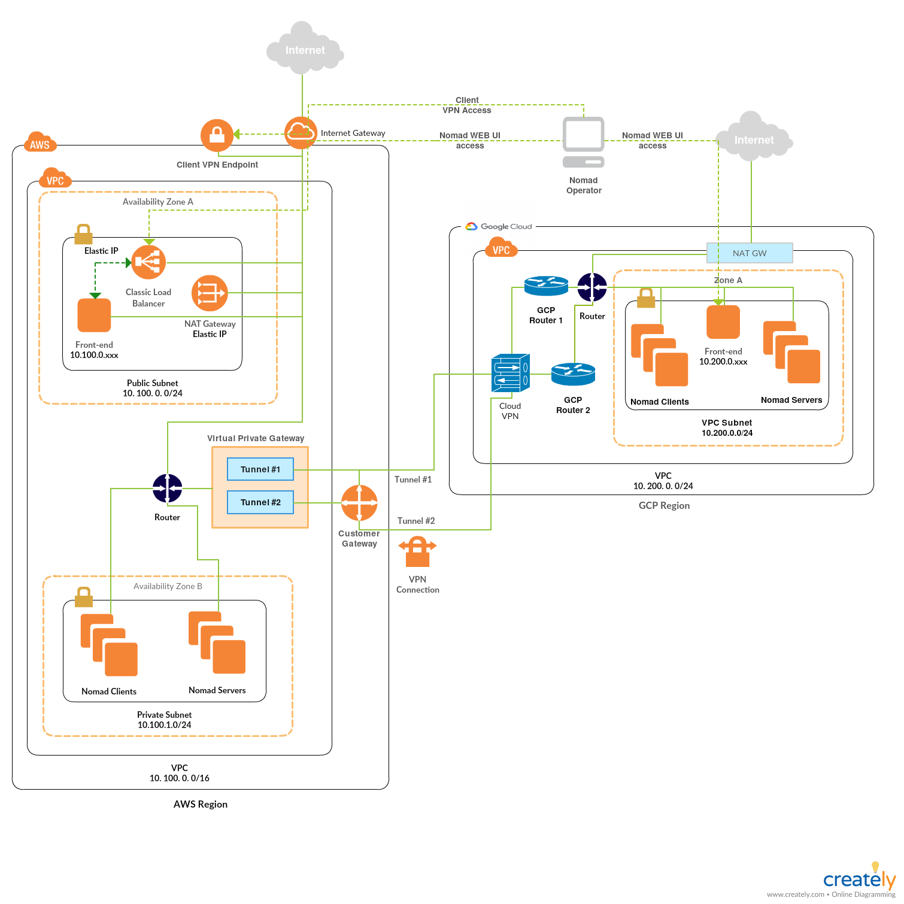

# Deploy Nomad multicloud (AWS & GCP) federation cluster with Terraform in different Nomad regions & DCs, secured with mTLS and frontend with nginx reverse proxy

## High Level Overview



## Prerequisites

- git
- terraform (>=0.12)
- own or control registered domain name for the certificate 
- have a DNS record that associates your domain name and your server’s public IP address
- Cloudflare subscription as it is used to manage DNS records automatically
- AWS subscription
- GCP subscription
- ssh key
- Use pre-built nomad server,client and frontend AWS AMIs and GCP Images or bake your own using [Packer](https://www.packer.io)

## How to deploy

#### Create `terraform.tfvars` file

```
// ******** NOMAD GLOBAL VARS ******** //

nomad_region_aws     = "aws"
nomad_region_gcp     = "gcp"
authoritative_region = "aws"
gcp_subdomain_name   = "nomad-ui-gcp"
aws_subdomain_name   = "nomad-ui-aws"
make_federation      = "false"

// ************  AWS VARS ************ //

access_key       = "aws_access_key"
secret_key       = "aws_secret_key"
aws_region       = "aws_region"
vpc_name         = "aws_vpc_name_tag"
region           = "aws_vpc_region_tag"
ami_nomad_server = "server-ami-id"
ami_nomad_client = "client-ami-id"
ami_frontend     = "frontend-ami-id"

// ************ GCP VARS ************ //

gcp_credentials_file_path = "gcp_credentials_file_path"
gcp_project_id            = "gcp_project_id"
gcp_region                = "gcp_region"

// ********* CLOUDFLARE VARS ********* //

cloudflare_email = "me@example.com"
cloudflare_token = "your_cloudflare_token"
cloudflare_zone  = "example.com"

```

- For more details about all available input options read the readmes of module for
  - [AWS VPC](https://github.com/achuchulev/terraform-aws-vpc-natgw/blob/master/README.md)
  - [GCP VPC](https://github.com/achuchulev/terraform-gcp-vpc/blob/master/README.md)
  - [AWS<->GCP VPN](https://github.com/achuchulev/terraform-aws-gcp-vpn/blob/master/README.md)
  - [AWS Client VPN](https://github.com/achuchulev/terraform-aws-client-vpn-endpoint/blob/master/README.md)
  - [AWS NOMAD Cluster](https://github.com/achuchulev/terraform-aws-nomad/blob/master/README.md)
  - [GCP NOMAD Cluster](https://github.com/achuchulev/terraform-gcp-nomad/blob/master/README.md)

#### Initialize terraform

```
terraform init
```

#### Generate Server and Client Certificates and Keys for the Client VPN Endpoint

Run `$ .terraform/modules/aws-client-vpn/scripts/gen_acm_cert.sh ./<cert_dir> <domain>`

- Script will:
  - make a `cert_dir` in the root
  - create private Certificate Authority (CA)
  - issue server certificate chain
  - issue client certificate chain
  
Note: This is based on official AWS tutorial described [here](https://docs.aws.amazon.com/vpn/latest/clientvpn-admin/authentication-authorization.html#mutual)

#### Deploy Nomad multicloud infrastructure

```
terraform plan
terraform apply
```

- `Terraform apply` will create:
  - install cfssl (Cloudflare's PKI and TLS toolkit)
  - generate selfsigned certificates for Nomad cluster
  - one VPC on AWS with one Public and one or more Private subnets with NAT GW
  - one VPC on GCP with Cloud NAT
  - VPN between AWS VPC and GCP VPC
  - cient VPN Endpoint to the AWS VPC
  - new instances on AWS Region for server(3)/client(1)/frontend(1/0)
  - new instances on GCP for server(3)/client(1)/frontend(1/0)
  - configure each of the frontend servers as a reverse proxy with nginx
  - automatically enable HTTPS for Nomad frontend with EFF's Certbot, deploying Let's Encrypt certificate
  - check for certificate expiration and automatically renew Let’s Encrypt certificate
  - create Nomad cluster federation between the clusters on GCP && AWS clouds

## To do

 - configure Nomad frontend with LB
 - expose public ip of LB only
  
## Access Nomad

#### via CLI

for example:

```
$ nomad node status
$ nomad server members
```

#### via WEB UI console

Open web browser, access nomad web console using your instance dns name as URL and verify that 
connection is secured and SSL certificate is valid  

## Run nomad job

#### via UI

- go to `jobs`
- click on `Run job`
- author a job in HCL/JSON format or paste the sample nomad job [nomad_jobs/nginx.hcl](https://github.com/achuchulev/terraform-aws-nomad-1dc-1region/blob/master/nomad_jobs/nginx.hcl) that run nginx on docker
- run `Plan`
- review `Job Plan` and `Run` it

#### via CLI

- Import vpn file `client-config.ovpn` into your preffered vpn client and connect.
- ssh to some of the nomad servers
- run a job

```
$ ssh ubuntu@nomad.server.ip
$ nomad job run [options] <job file>
```
