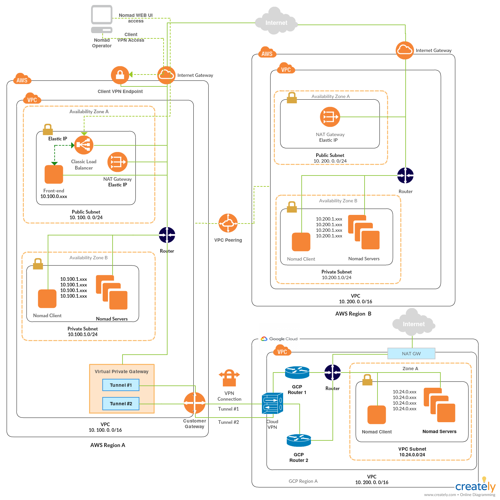

# Terraform configuration to deploy Nomad multicloud (AWS & GCP) federation cluster in different Nomad regions & DCs, secured with mTLS and frontend with nginx reverse proxy. A kitchen test is included

## High Level Overview



## Prerequisites

- git
- terraform (>=0.12)
- own or control registered domain name for the certificate 
- have a DNS record that associates your domain name and your server’s public IP address
- Cloudflare subscription as it is used to manage DNS records automatically
- AWS subscription
- GCP subscription
- ssh key
- Use pre-built nomad server,client and frontend AWS AMIs and GCP Images or bake your own using [Packer](https://www.packer.io)

## How to deploy

#### Create `terraform.tfvars` file

```
// ******** NOMAD GLOBAL VARS ******** //
nomad_region_aws     = "aws"
nomad_region_gcp     = "gcp"
authoritative_region = "aws"
gcp_subdomain_name   = "nomad-ui-gcp"
aws_subdomain_name   = "nomad-ui-aws"

// ************  AWS VARS ************ //

access_key           = "aws_access_key"
secret_key           = "aws_secret_key"
aws_region           = "aws_region"
vpc_name             = "aws_vpc_name_tag"
region               = "aws_vpc_region_tag"

// ************ GCP VARS ************ //

gcp_credentials_file_path = "gcp_credentials_file_path"
gcp_project_id            = "gcp_project_id"
gcp_region                = "gcp_region"

// ********* CLOUDFLARE VARS ********* //

cloudflare_email     = "me@example.com"
cloudflare_token     = "your_cloudflare_token"
cloudflare_zone      = "example.com"

```

- For all available input options refer to
  - [AWS VPC Module](https://github.com/achuchulev/terraform-aws-vpc-natgw)
  - [GCP VPC Module](https://github.com/achuchulev/terraform-gcp-vpc)
  - [AWS<->GCP VPN Module](https://github.com/achuchulev/terraform-aws-gcp-vpn)
  - [AWS Client VPN Module](https://github.com/achuchulev/terraform-aws-client-vpn-endpoint)
  - [AWS NOMAD Cluster Module](https://github.com/achuchulev/terraform-aws-nomad)
  - [GCP NOMAD Cluster Module](https://github.com/achuchulev/terraform-gcp-nomad)

#### Initialize terraform

```
terraform init
```

#### Generate Server and Client Certificates and Keys for the Client VPN Endpoint

Run `$ .terraform/modules/aws-client-vpn/scripts/gen_acm_cert.sh ./<cert_dir> <domain>`

- Script will:
  - make a `cert_dir` in the root
  - create private Certificate Authority (CA)
  - issue server certificate chain
  - issue client certificate chain
  
Note: This is based on official AWS tutorial described [here](https://docs.aws.amazon.com/vpn/latest/clientvpn-admin/authentication-authorization.html#mutual)

#### Deploy Nomad multicloud infrastructure

```
terraform plan
terraform apply
```

- `Terraform apply` will create:
  - install cfssl (Cloudflare's PKI and TLS toolkit)
  - generate selfsigned certificates for Nomad cluster
  - one VPC on AWS with one Public and one or more Private subnets with NAT GW
  - one VPC on GCP with Cloud NAT
  - VPN between AWS VPC and GCP VPC
  - cient VPN Endpoint to the AWS VPC
  - new instances on AWS Region for server(3)/client(1)/frontend(1/0)
  - new instances on GCP for server(3)/client(1)/frontend(1/0)
  - configure each of the frontend servers as a reverse proxy with nginx
  - automatically enable HTTPS for Nomad frontend with EFF's Certbot, deploying Let's Encrypt certificate
  - check for certificate expiration and automatically renew Let’s Encrypt certificate
  - create Nomad cluster federation between the two clouds
  
## To do

 - configure Nomad frontend with LB
 - expose public ip of LB only
  
## Access Nomad

#### via CLI

for example:

```
$ nomad node status
$ nomad server members
```

#### via WEB UI console

Open web browser, access nomad web console using your instance dns name as URL and verify that 
connection is secured and SSL certificate is valid  

## Run nomad job

#### via UI

- go to `jobs`
- click on `Run job`
- author a job in HCL/JSON format or paste the sample nomad job [nomad_jobs/nginx.hcl](https://github.com/achuchulev/terraform-aws-nomad-1dc-1region/blob/master/nomad_jobs/nginx.hcl) that run nginx on docker
- run `Plan`
- review `Job Plan` and `Run` it

#### via CLI

```
$ nomad job run [options] <job file>
```

## Run kitchen test using kitchen-terraform plugin to verify that expected resources are being deployed   

### on Mac

#### Prerequisites

##### Install rbenv to use ruby version 2.3.1

```
brew install rbenv
rbenv install 2.3.1
rbenv local 2.3.1
rbenv versions
```

##### Add the following lines to your ~/.bash_profile:

```
eval "$(rbenv init -)"
true
export PATH="$HOME/.rbenv/bin:$PATH"
```

##### Reload profile: 

`source ~/.bash_profile`

##### Install bundler

```
gem install bundler
bundle install
```

#### Run the test: 

```
bundle exec kitchen list
bundle exec kitchen converge
bundle exec kitchen verify
bundle exec kitchen destroy
```

### on Linux

#### Prerequisites

```
gem install test-kitchen
gem install kitchen-inspec
gem install kitchen-vagrant
```

#### Run kitchen test 

```
kitchen list
kitchen converge
kitchen verify
kitchen destroy
```

### Sample output

```
```
